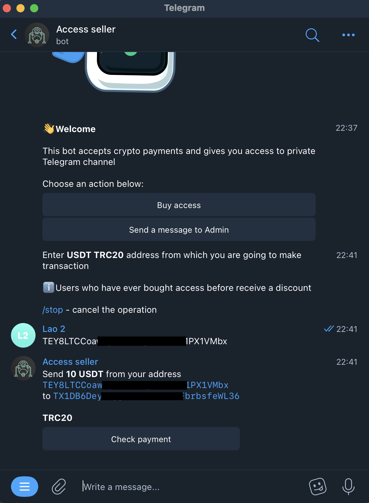
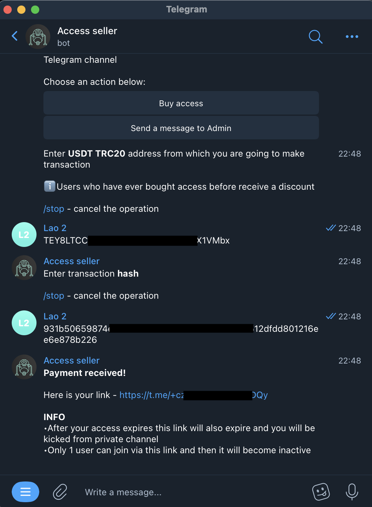
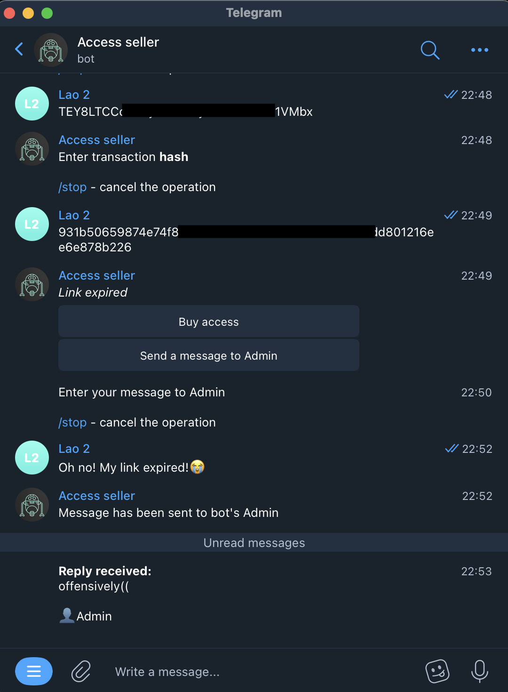
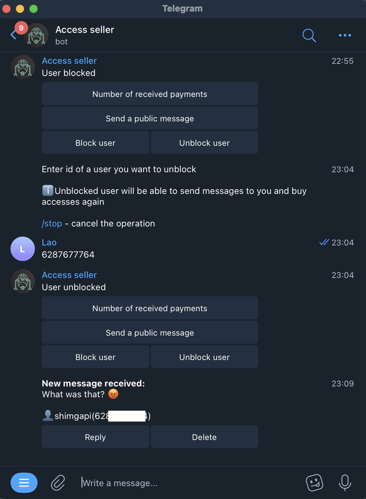
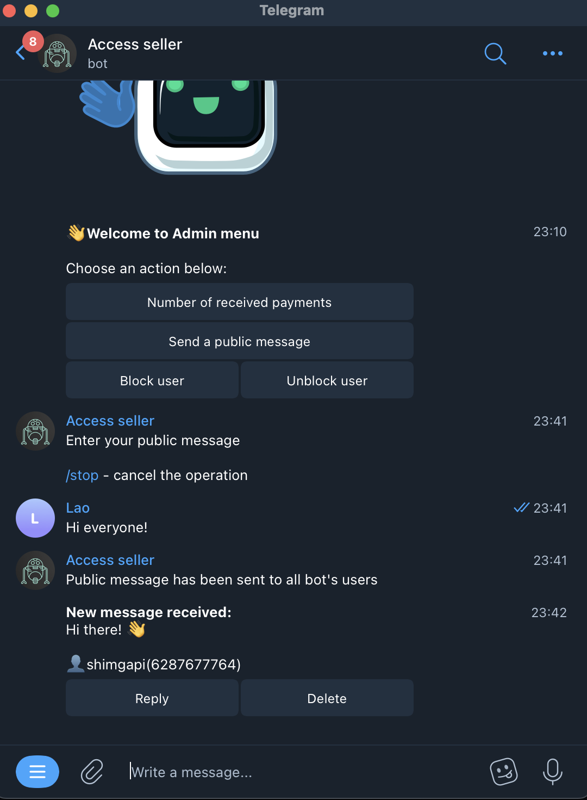
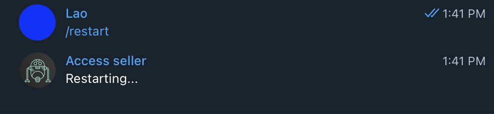
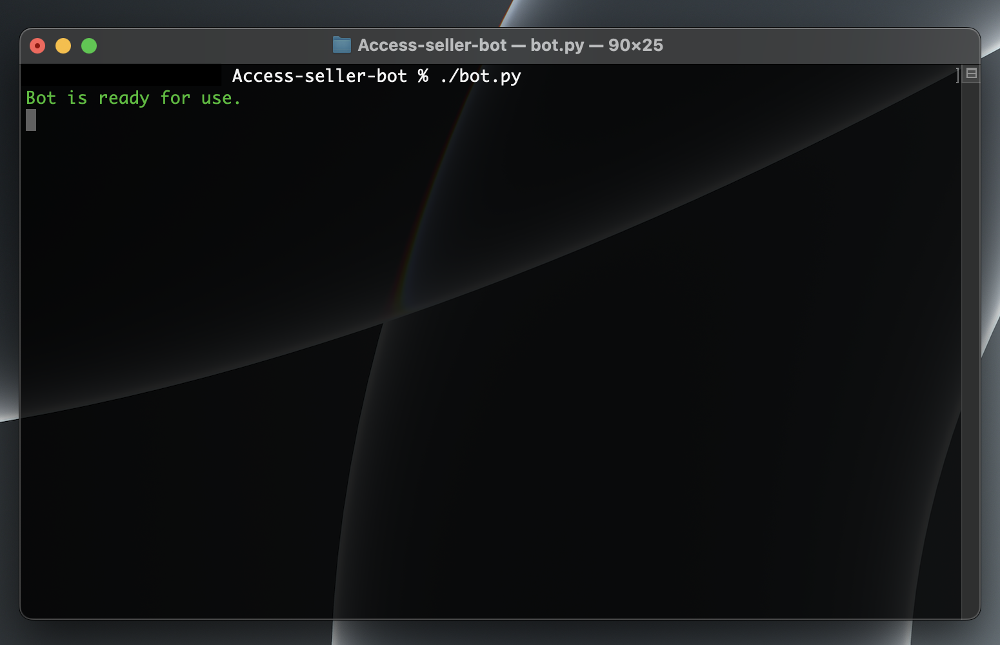

<p align="center">
  
</p>

<h1 align="center">
    Access Seller Bot
</h1>

* [More info](#more-info)
* [Installation](#installation)


## Screenshots
#### As user:
<p>
  
  
  
  
  
</p>

#### As admin:
<p>
  
  
  
</p>

#### Other:
<p>
  
  
</p>


## More info
Access seller is a Telegram bot which is needed for buying access to private Telegram channels.<br>This bot accepts only crypto payments and it has a function of communication between users and bot's admin.


## Installation
### macOS/Linux
*Note:* you need to have Python3 and Git installed in your system before moving to the installation steps.
1. Copy and paste this command into the Terminal:
```
git clone https://github.com/codelao/Access-seller-bot.git && cd Access-seller-bot && chmod +x configure.sh && ./configure.sh
```
2. After completing the configuration steps you'll be able to run the bot from this directory everytime by using this command:
```
./bot.py
```
*Note 2:* if you want to reconfigure your bot, you can use `./configure.sh` command in bot's directory again.

### Windows 10, 11
*Note:* you need to have Python3 and Git installed in your system before moving to the installation steps.
1. Copy and paste this command into the Command Prompt:
```
git clone https://github.com/codelao/Access-seller-bot.git && cd Access-seller-bot && configure
```
2. After completing the configuration steps you'll be able to run the bot from this directory everytime by using this command:
```
python3 bot.py
```
*Note 2:* if you want to reconfigure your bot, you can use `configure` command in bot's directory again.
