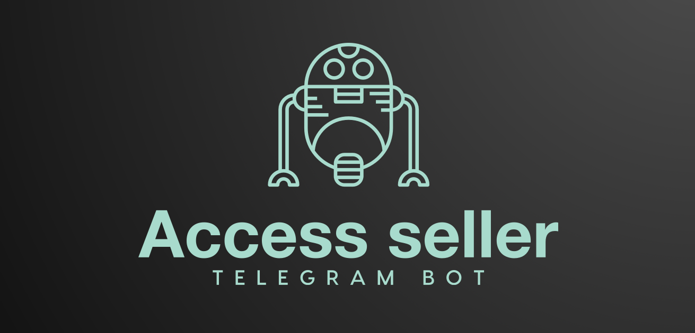
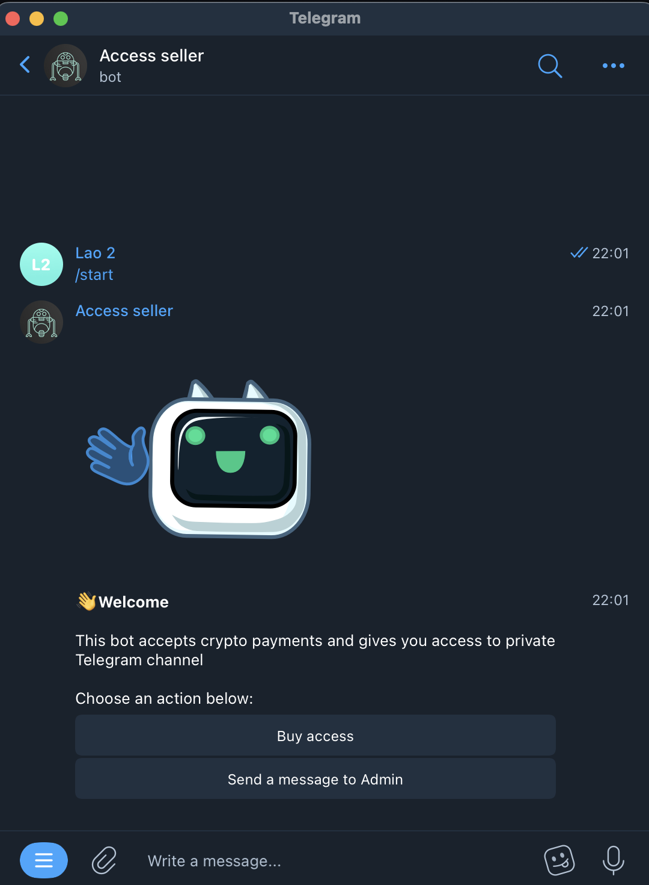
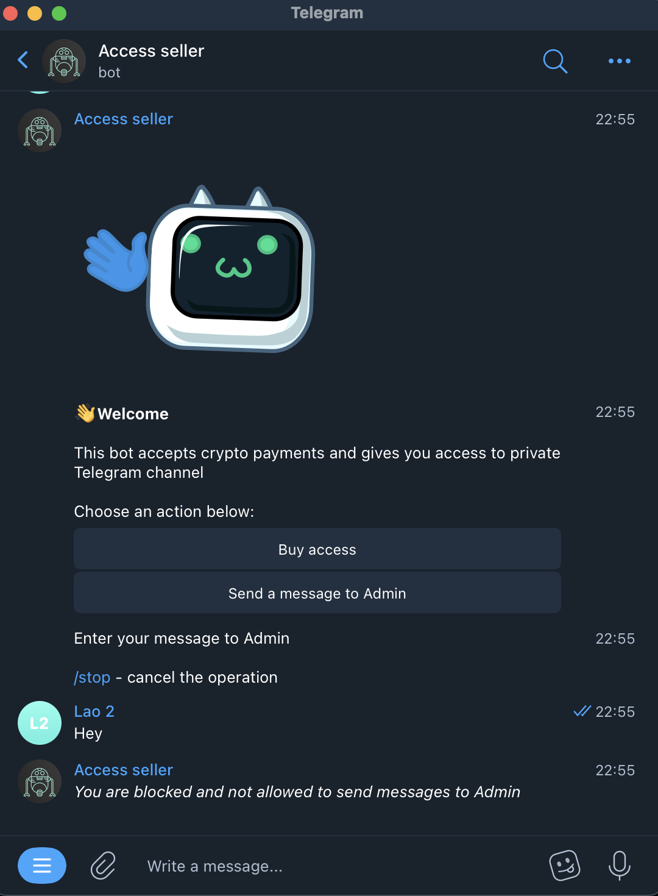
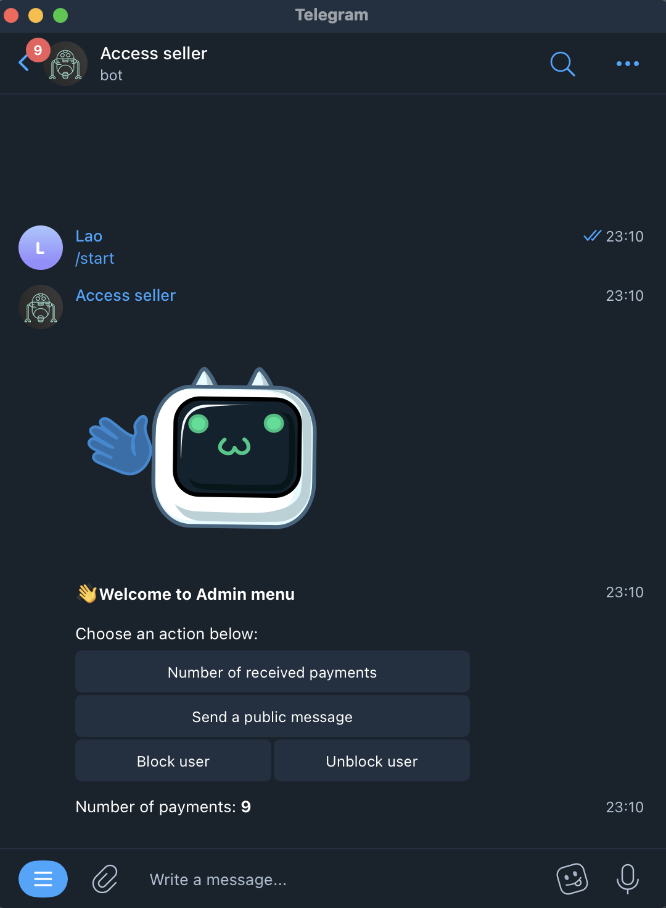
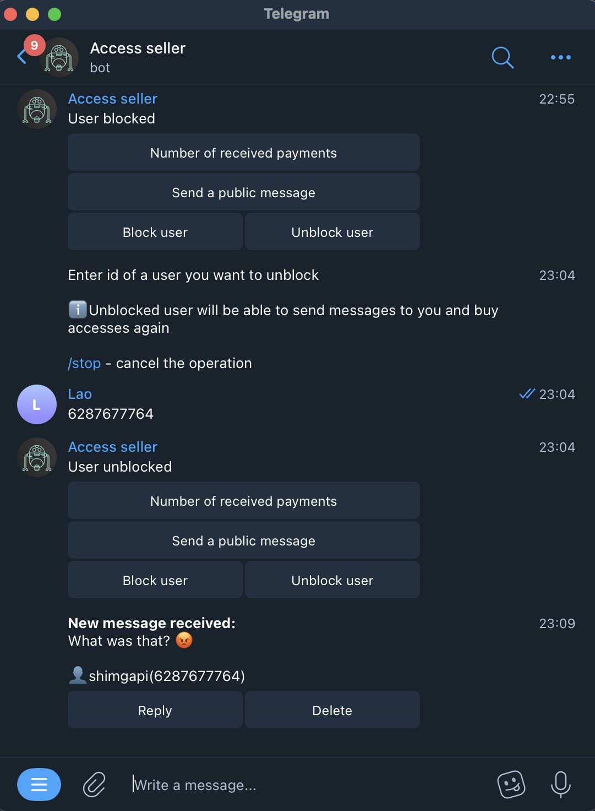

<p align="center">
  
</p>

<h1 align="center">
    Access seller (Telegram bot)
</h1>

* [More info](#more-info)
* [Installation](#installation)


## Screenshots
#### As user:

<p>
  
  
  
  
  
</p>

#### As Admin:

<p>
  
  
  
</p>


## More info
Access seller is a Telegram bot which is needed for buying access to private Telegram channels

This bot accepts only crypto payments and it has a function of communication between users and Admin


## Installation

#### Step 1 - *Bot installation*
```
$ git clone https://github.com/codelao/Access-seller-bot.git
$ cd Access-seller-bot
$ pip3 install -r requirements.txt
$ cd code
```

#### Step 2 - *Сhanging bot's parameters*
Go to installed **config.py** file on your computer

Enter your bot's token there and change other bot's parameters based on your preferences

It is very important to change this parameters as bot will not work correctly without them

#### Step 3 - *Bot launch*
```
$ python3 bot.py
```